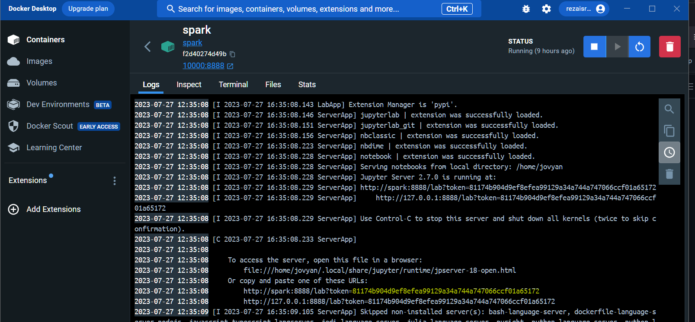

# Final Project

## Overview
Our final project consists of a multi-container application that runs a Kafka stream processing pipeline using Docker. The solution is split into five main components, each running in its own Docker container:

1. **Kafka Zookeeper**: A service necessary for running the Kafka broker. It helps in maintaining the configuration information and provides distributed synchronization.
2. **Kafka Broker**: The heart of the Kafka system that maintains the published data. Each Kafka broker can handle terabytes of messages without performance impact.
3. **Kafka Producer (Python)**: This application pulls data from the National Rail APIs and publishes it to Kafka. It's designed to run indefinitely, continually pulling and publishing data.
4. **Kafka Consumer (Spark)**: A Spark application that consumes data from Kafka, processes it and writes the result to a PostgreSQL database.
5. **PostgreSQL Database (db)**: Stores the processed data from the Spark consumer for later analysis.

The `docker-compose.yaml` file in the root directory defines the services that make up the application so they can be run together in an isolated environment. It also sets up the necessary environment variables, port mappings, and volume bindings.

## Steps

Follow these steps to build and run the project.

### 1. Environmental Variables Setup - National Rail

You need to define environment variables for the Python Kafka producer and the PostgreSQL database. These variables can be set in a `.env` file located in the same directory as the `docker-compose.yaml` file. Here's an example of what the `.env` file could look like:

```bash
# National Rail API and Kafka variables
USERNAME=your-username
PASSWORD=your-password
HOSTNAME=your-hostname
HOSTPORT=61613
TOPIC=/topic/darwin.pushport-v16
KAFKA_TOPIC=darwin
HEARTBEAT_INTERVAL_MS=15000
RECONNECT_DELAY_SECS=15
```
Replace `your-username`, `your-password`, `your-hostname`, `your-topic`, and `your-kafka-topic` with the actual values. This file should not be committed to your source control system.

### 2. Database Initialization & Configuration

The output of this pipeline writes to your PostgreSQL database (hosted on AWS). You need to tell
the spark process how to connect to your database.

1. Update your `.env` file. Add the following properties to the bottom. If you've followed the guide for setting up PostgreSQL on AWS, you should have these values.

    ```bash
    # PostgreSQL variables
    POSTGRES_USERNAME=your-aws-db-username
    POSTGRES_PASSWORD=your-aws-db-password
    POSTGRES_HOSTNAME=your-aws-db-hostname
    POSTGRES_PORT=your-aws-db-port
    POSTGRES_DBNAME=your-aws-db-name
    ```

    Pro tip: If you're attempting to connect to a local database instead of AWS, use `host.docker.internal` for HOSTNAME, not `localhost`. `localhost` would look for Postgres *inside* of docker.

2. You'll need to create a `darwin` table in your RDS instance. Copy, paste and run the `init.sql` script (in the same folder as this readme) in order to create the table with the correct columns.

### 3. Docker Images Building

For each component, enter the directory and build the Docker image using the `docker build` command as shown below. Make sure to build the images in the following order and with the same names:

1. Zookeeper: `zookeeper:latest`
2. Broker: `broker:latest`
3. Producer `kafkaproducer:latest`
4. Consumer: `spark:latest`

```bash
$ cd zookeeper
$ docker build . -t zookeeper:latest
```

### 4. Running the Containers

In the root directory where the `docker-compose.yaml` file is located, bring up the containers by running:

```bash
$ docker compose up
```

### 5. Accessing JupyterLab

From the Docker Dashboard, view the `spark` container logs and find the JupyterLab link along with the token:

You would want to grab the token from this log message. 


```
2023-07-27 12:35:08 [I 2023-07-27 16:35:08.228 ServerApp] Jupyter Server 2.7.0 is running at:
2023-07-27 12:35:08 [I 2023-07-27 16:35:08.229 ServerApp] http://spark:8888/lab?token=81174b904d9ef8efea99129a34a744a747066ccf01a65172
2023-07-27 12:35:08 [I 2023-07-27 16:35:08.229 ServerApp]     http://127.0.0.1:8888/lab?token=81174b904d9ef8efea99129a34a744a747066ccf
```

Using this token, go to the following link in your browser http://localhost:10000/lab?token=your-token

### 6. Running the Applications

Within the JupyterLab environment, there are two main Python files that need to be run:

* `spark_consumer.py` contains the code to run the Spark consumer that reads data from the Kafka topic.
* `clean_data.py` contains the code to process the consumed data, transform it into a DataFrame, and write the result to a database. 

Start running both of these files by opening a separate terminal for each in JupyterLab and running `python .py`. Each file will keep running indefinitely as they work together to consume messages from Kafka and write them to your database.

NOTE: In order to troubleshoot the database connection, here are two tips.
1. The output and errors from `clean_data.py` can be found in `etl.log`.
2. Use this command from a terminal in JupyterLab to confirm what database URL is being used: `echo $DATABASE_URL`
#   Development notes
**broker:**
This sets up the kafka service from confluentinc/cp-kafka:7.3.0
**nationalrail_producer:**
This sets up the kafka producer that reads data from nationalrail.co.uk
- opendata-nationalrail-client.py is the python script that reads the data from the API and feeds into kafka
- **spark:**
This is the kafka consumer and the script that loads the data into the PostgreSQL database.
- clean_data.py - this cleans the data from the API
  - Convert time columns to datetime.time
  - computes final_df['aat'] = final_df['arr'].apply(lambda d: d.get('et'))  # Lines 115
  - computes final_df['adt'] = final_df['dep'].apply(lambda d: d.get('et'))   # Lines 116
  - Convert 'delayed' to boolean (122-123)
  - Converts time columns to pd.to_datetime (125-127)
- spark_consumer.py - This reads the stream from kafka and then writes to the database.
- *zookeeper:**
This is the zookeeper for the kafka cluster based on confluentinc/cp-zookeeper:7.3.0
a succinct explanation of zookeeper:
Zookeeper keeps track of status of the Kafka cluster nodes and it also keeps track of Kafka topics, partitions etc.
from: https://www.cloudkarafka.com/blog/cloudkarafka-what-is-zookeeper.html